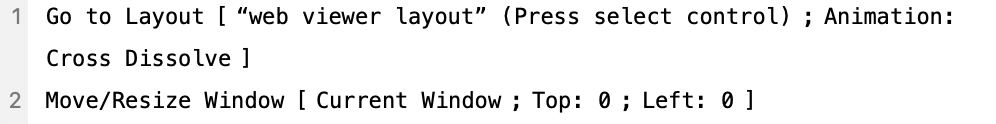

# Paper Layout Organizer
[](https://app.netlify.com/sites/paperlayoutorganizer/deploys)


Paper Layout Organizer is a web application that lets users dynamically create, resize, rotate, and arrange custom rectangular frames on a virtual paper with adjustable margins and units, automatically optimizing the layout and displaying the resulting paper dimensions.

## About
- Automates the arrangement of images on paper with spacing algorithms with DOM manipulation
- Interactive drag-and-drop functionality, SVG-based alignment and cutting guidelines, unit conversion, and CSS transformations for rotations


## Project Setup

```sh
npm install
```

### Compile and Hot-Reload for Development

```sh
npm run dev
```

### Compile and Minify for Production

```sh
npm run build
```
## FMP Web Viewer Layout Script


